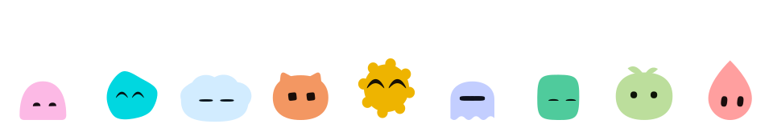
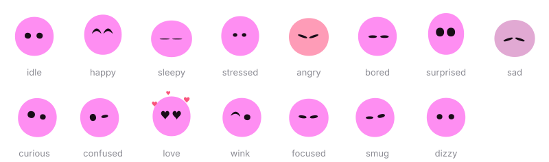

<p align="center">
  
</p>

<h1 align="center">DesktopBuddy</h1>

<p align="center">
  <strong>A tiny creature that lives on your desktop.</strong><br>
  It watches your cursor, gets sleepy, gets grumpy, and looks like no one else's.
</p>

<p align="center">
  
  
  
  
</p>

---

## Meet your buddy

Give it a name and it grows a face. The name decides everything: its shape, its colour, its eyes, even the rhythm it breathes to. The same name always makes the same buddy, and a different name makes a completely different one, so yours is yours.

Then it just lives there. It sits on top of your windows, keeps an eye on your cursor wherever it goes, and has opinions about its day. Maybe one day it'll even answer back when you type to it.

<p align="center">
  
</p>

## What it can do

**One of a kind.** Ten body shapes, five eye styles and a full colour wheel, mixed by name. Like one part but not the rest? Pin just that part and let the name decide everything else.

**Alive, not looping.** It breathes, bobs, blinks and glances around on its own timing, so two buddies side by side rarely move in step.

**Always watching.** Its eyes follow your cursor anywhere on the screen, not just when you're close. Leave the mouse alone and it starts looking around by itself.

**Moods you can read.** Happy, sleepy, stressed, angry and bored, each with its own face and body language. An angry buddy flushes red and trembles.

**Pet it. Carry it.** Click to make it happy. Grab it and drop it wherever you like.

**Never in the way.** Only the buddy itself catches your mouse. The space around it lets clicks straight through to whatever is underneath.

## Make it yours

Right-click your buddy to open the customise panel:

- Rename it, or roll a random name.
- Pick a body shape, including six hand-drawn extras: mochi, bean, ghost, kitty, sprout and slime.
- Choose its eyes: dots, domes, squares, capsules or visor.
- Fine-tune those eyes: size, width, spacing, squareness, tilt, height and how far left or right they sit.
- Set its colour and tone.
- Change its size and opacity.
- Turn cursor-following and always-on-top on or off.

Everything saves automatically, and your buddy is waiting just as you left it next time.

## Coming soon

- **A warm welcome.** A short introduction the first time you open DesktopBuddy: meet your new buddy, give it a name, and learn how to pet it, carry it and make it yours.
- **It notices your PC.** It reads your CPU and memory and reacts: stressed when your machine is working hard, sleepy when it's quiet.
- **Stats at a glance.** A small panel beside your buddy with CPU, RAM and the time.
- **Personality.** Speech bubbles, time-of-day greetings and comments on what your computer is up to.
- **A proper install.** A Windows installer and an option to start with Windows.

Windows comes first. Linux and macOS may follow later.

## Maybe one day

These are ideas being explored, not promises. They aren't built yet, and they may change or never happen.

- **Chat with your buddy.** Type a message and your buddy replies in a speech bubble, in character, with a thinking face while it waits. It would run on an AI of your choice (Claude, GPT, Gemini, or a local model through Ollama) using your own API key, kept encrypted on your machine.
- **Talk out loud.** If chatting works out, speaking to your buddy could follow.

## Made with AI help

To be clear about how this app is made: AI has been used to help build DesktopBuddy from the start, and it still is. AI coding assistants, including Claude, help design the buddy, write code and draft docs like this one. I directs the project and decides what gets built and what ships.

---

## 🛠️ Under the Hood

Everything below is for developers and anyone curious about how DesktopBuddy is built. It's a hybrid stack: a modern web frontend for the buddy and its UI, and (coming soon) a C backend for low-level system access.

### How the faces work

There are no images or sprite sheets. Every buddy is drawn from scratch, in code:

1. The name is hashed, and each trait (shape, size, eye spacing, colour, blink rate and more) gets its own value from it.
2. Bodies are built from superellipses, smooth splines and overlapping circles.
3. Colours are picked in OKLCH, so every hue looks equally vivid, and the eyes always keep strong contrast against the body.
4. Moods reshape the eyes and shift the body's posture, so every face style can show every mood.

### 🚀 Getting Started

You'll need Windows and Node.js 18 or later.

```bash
npm install
npm run dev
```

Right-click the buddy to customise it. To browse lots of faces at once, open `http://localhost:5173/?gallery` while the dev server is running.

### 🧱 Tech Stack

| Layer | Technology | Purpose |
|---|---|---|
| UI & Mascot | React + TypeScript | The buddy and the customise panel |
| Animation | Framer Motion + CSS | Mood changes, eye movement, breathing and blinking |
| Desktop Shell | Electron + Vite | Transparent always-on-top window, click-through, tray |
| State | Zustand | Moods, plus settings saved between restarts |
| System Stats | C (native Node addon via `node-addon-api`) *(planned)* | CPU, RAM via Windows API |
| Packaging | electron-builder *(planned)* | Windows installer |
| AI Chat | Claude, GPT, Gemini, Ollama *(possible future)* | Typing to your buddy with your own API key |

### 📂 Project Structure

```
desktop_buddy/
├── electron/
│   ├── main.ts              # Window creation
│   ├── preload.ts           # Secure contextBridge IPC
│   ├── tray.ts              # System tray menu
│   ├── cursor.ts            # Feeds the cursor position so the eyes can follow it
│   ├── interaction.ts       # Click-through, dragging, always-on-top
│   └── stats-bridge.ts      # (planned) Calls the C addon, exposes via IPC
├── src/
│   ├── components/
│   │   ├── Buddy/           # Face generator, moods, animation
│   │   ├── SettingsPanel/   # Right-click customise panel
│   │   ├── StatHUD/         # (planned)
│   │   └── SpeechBubble/    # (planned)
│   ├── hooks/               # Cursor gaze, desktop mouse handling, (planned) system stats
│   ├── stores/              # Buddy state and saved settings
│   ├── dev/Gallery.tsx      # Face browser, opened with ?gallery
│   └── App.tsx
├── native/                  # (planned) stats.c, stats.h, binding.gyp
└── docs/                    # README artwork
```

### 🗺️ Roadmap

DesktopBuddy is built in public, one phase at a time, with a C fundamentals track running alongside the app.

#### Phase 1 — Project Scaffold
> Get a transparent, frameless Electron window on screen with a placeholder mascot.

- [x] Scaffold Electron + Vite + React (TypeScript template)
- [x] Configure `BrowserWindow` for transparent + frameless + always-on-top
- [x] Implement drag-to-move via mouse events
- [x] Add system tray icon with show/hide/quit
- [x] Render a placeholder mascot (a coloured shape is fine to start)

#### Phase 2 — Mascot Animation System
> A living mascot with at least 3 animation states.

- [x] Design the mascot: SVG faces generated from the buddy's name
- [x] Buddy states: `idle`, `happy`, `sleepy`, `stressed`, `angry`, `bored`
- [x] Use Framer Motion to morph between moods
- [x] Implement an idle loop — buddy breathes, bobs and blinks on a timer
- [x] Click interaction triggers `happy` state
- [ ] Click interaction also shows a speech bubble
- [ ] Build `SpeechBubble` component (appears, holds, fades out)

#### Phase 3 — C Stats Module
> Write real C that reads system stats via the Windows API and exposes it to Electron.

- [ ] Set up `node-addon-api` in the project
- [ ] Write `stats.c` — reads CPU usage via `GetSystemTimes`
- [ ] Write `stats.c` — reads RAM usage via `GlobalMemoryStatusEx`
- [ ] Compile to a `.node` native addon
- [ ] Create `stats-bridge.ts` — IPC handler that calls the C addon
- [ ] Create `useSystemStats` hook that polls via IPC every 2 seconds

#### Phase 4 — Stat HUD
> The mascot shows a compact stats panel on click or hover.

- [ ] Build `StatHUD` component — expandable panel anchored to the mascot
- [ ] Display CPU %, RAM used/total, current time
- [ ] Animate in/out with Framer Motion `AnimatePresence`
- [ ] Mascot reacts to stats: high CPU → `stressed`, low RAM → `sleepy`

#### Phase 5 — Personality & Dialogue
> The buddy says things, has a name, and notices stuff.

- [x] User-configurable buddy name, saved between restarts (the name also generates the face)
- [ ] Dialogue system: a pool of lines per mood state
- [ ] Buddy comments on stats contextually
- [ ] Time-aware greetings (morning / afternoon / evening / late night)
- [x] Settings panel: name, look, size, opacity, behaviour
- [x] Eye customisation: style (dots, domes, squares, capsules, visor), size, width, spacing, squareness, tilt, height and sideways position
- [ ] Stat toggles in the settings panel

#### Phase 6 — Polish & Release
> Wrap it up into something shareable.

- [ ] First-run onboarding: introduce the buddy, let the user name it, and show how to pet, drag and customise it
- [ ] Package with `electron-builder` for Windows
- [ ] Auto-start on login
- [x] Multiple buddy looks: every name is a different buddy, plus six hand-drawn extras
- [ ] JSON manifest per character: sprite paths + dialogue pools
- [ ] Exportable/shareable config files

#### Possible Future — AI Chat
> Being explored, not committed. Not started, and the details may change.

- [ ] Type to your buddy and get replies in a speech bubble, in character
- [ ] A "thinking" face while it waits, and moods that react to the conversation
- [ ] Choose Claude, GPT, Gemini or a local model through Ollama, with your own API key
- [ ] Keep API keys encrypted on your machine (Electron `safeStorage`), never exposed to the UI
- [ ] Later: talking out loud, and tools like timers and reminders

#### Stretch Goal — Cross-Platform
> Not planned, but possible later.

- [ ] Abstract stats module for Linux (`/proc/stat`, `/proc/meminfo`)
- [ ] Handle `#ifdef _WIN32` / `#ifdef __linux__` in C code
- [ ] Test tray behaviour on Linux and macOS
- [ ] Package for Linux and macOS targets

### 📖 Resources

- **C fundamentals:** [Bro Code — C Full Course (YouTube)](https://www.youtube.com/watch?v=xND0t1pr3KY)
- **C reference:** [Beej's Guide to C Programming](https://beej.us/guide/bgc/)
- **Electron:** [Electron Quick Start](https://www.electronjs.org/docs/latest/tutorial/quick-start)
- **Framer Motion:** [motion.dev/docs](https://motion.dev/docs)
- **Zustand:** [github.com/pmndrs/zustand](https://github.com/pmndrs/zustand)
- **Native addons:** [Node.js Addons Guide](https://nodejs.org/api/addons.html)

### 🙏 Thanks

The flat, geometric face style was inspired by [blobatar](https://blobatar.dev) by Alain.

*Built by I with AI assistance — learning in public, one phase at a time.*
