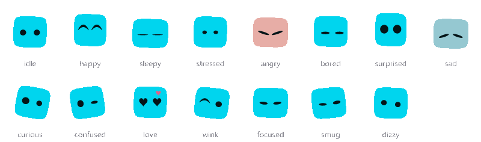

<p align="center">
  
</p>

<h1 align="center">DesktopBuddy</h1>

<p align="center">
  <strong>A tiny creature that lives on your desktop.</strong><br>
  It watches your cursor, gets sleepy, gets grumpy, and looks like no one else's.
</p>

<p align="center">
  
  <a href="#early-access"></a>
  
  
</p>

---

## Meet your buddy

Give it a name and it grows a face. The name decides everything: its shape, its colour, its eyes, even the rhythm it breathes to. The same name always makes the same buddy, and a different name makes a completely different one, so yours is yours.

Then it just lives there. It sits on top of your windows, keeps an eye on your cursor wherever it goes, and has opinions about its day. Maybe one day it'll even answer back when you type to it.

<p align="center">
  
</p>

## What it can do

**One of a kind.** Ten body shapes, five eye styles and a full colour wheel, mixed by name, plus six hand-drawn extras to choose from. Like one part but not the rest? Pin just that part and let the name decide everything else.

**Alive, not looping.** It breathes, bobs, sways, blinks and glances around on its own timing, with the odd double blink, so two buddies side by side rarely move in step.

**Always watching.** Its eyes follow your cursor anywhere on the screen, up and down as well as side to side, and its body leans in a beat later, like it's turning to look. Leave the mouse alone and it starts looking around by itself.

**Moods you can read.** Fifteen of them, from happy, sad and sleepy to curious, confused, smug and dizzy, each with its own face and body language. An angry buddy flushes red and trembles, a sad one loses its colour, and one in love gets heart eyes as little hearts float up around it.

**It reacts to you.**

<p align="center">
  
</p>

- Press on it and it squishes under your cursor, then springs back when you let go. Pet it and it's happy, and now and then it winks back. Double-click it and it jumps, startled. Keep petting it and it falls in love.
- Pick it up and it looks surprised. Carry it around and it swings along behind your cursor, then sways to a stop. Drop it and it squashes as it lands. Shake it while you carry it and it gets dizzy.
- Move your cursor onto it and it perks up. Hover a moment and it tilts its head, curious.
- Leave your computer alone and it gets bored, then dozes off. It wakes up with a start when you come back.
- Give it a new look and it pops up, surprised. Start the app and it wakes up with a stretch.

**Never in the way.** Only the buddy itself catches your mouse. The space around it lets clicks straight through to whatever is underneath.

**A warm welcome.** The first time you open DesktopBuddy, your new buddy introduces itself in speech bubbles. You name it (its face changes as you type), then try petting it, carrying it and giving it a new look. You can skip it, or replay it any time from the tray.

**Lives in your tray.** The tray icon is your own buddy, and it changes whenever your buddy does.

**Keeps itself up to date.** New versions download in the background, with a little progress ring floating over your buddy's head, and it tells you in a speech bubble when one is ready. Restart it there and then, or it updates the next time it closes. Either way, it pops back up on the new version, tells you so, and can show you what's new. You can see what's new any time from the tray.

## Make it yours

<p align="center">
  
</p>

Right-click your buddy to open the customise panel:

- Rename it, or roll a random name.
- Pick a body shape, including six hand-drawn extras: mochi, bean, ghost, kitty, sprout and slime.
- Choose its eyes: dots, domes, squares, capsules or visor.
- Fine-tune those eyes: size, width, spacing, squareness, tilt, height and how far left or right they sit.
- Set its colour and tone.
- Change its size and opacity.
- Turn cursor-following and always-on-top on or off.

Everything saves automatically, and your buddy is waiting just as you left it next time.

## Early access

DesktopBuddy is in early access, for **Windows 10 and 11 only** at the moment. It works, but it's new, so expect the odd rough edge.

1. Download the `DesktopBuddy-Windows-…-Setup.exe` file from the newest release on the [releases page](https://github.com/jaineeldev/desktop_buddy/releases).
2. Run it. The installer isn't code-signed yet, so Windows SmartScreen may show "Windows protected your PC". Click **More info**, then **Run anyway**.
3. Your new buddy wakes up and introduces itself.

Want it there every time you log in? Right-click the DesktopBuddy icon in your system tray and tick **Start with Windows**.

You only need to install it once. After that it keeps itself up to date, and your buddy tells you when a new version is ready. The one exception: if you installed the very first version (v0.1.0), download the newest one by hand once, because that version can't update itself.

**What it can and can't access.** DesktopBuddy needs no admin rights and asks for no special permissions.

- It reads where your mouse pointer is, so its eyes can follow it.
- It saves your buddy's name and settings on your PC.
- It connects to GitHub, and nothing else, to check for new versions. It doesn't collect or send any data about you.
- It starts with Windows only if you tick that option in the tray.
- It doesn't use your camera, microphone, location, clipboard or files.

The SmartScreen warning is there because the installer isn't code-signed yet, not because of anything the app does.

Found a bug or have an idea? [Open an issue](https://github.com/jaineeldev/desktop_buddy/issues). Early feedback shapes what comes next.

## Coming soon

- **It notices your PC.** It reads your CPU and memory and reacts: stressed when your machine is working hard, sleepy when it's quiet.
- **Stats at a glance.** A small panel beside your buddy with CPU, RAM and the time.
- **Personality.** Time-of-day greetings and little comments in speech bubbles about what your computer is up to.

Windows comes first. Linux and macOS may follow later.

## Maybe one day

These are ideas being explored, not promises. They aren't built yet, and they may change or never happen.

- **Chat with your buddy.** Type a message and your buddy replies in a speech bubble, in character, with a thinking face while it waits. It would run on an AI of your choice (Claude, GPT, Gemini, or a local model through Ollama) using your own API key, kept encrypted on your machine.
- **Talk out loud.** If chatting works out, speaking to your buddy could follow.

## Made with AI help

To be clear about how this app is made: AI has been used to help build DesktopBuddy from the start, and it still is. AI coding assistants, including Claude, help design the buddy, write code and draft docs like this one. I direct the project and decide what gets built and what ships.

---

## 🛠️ Under the Hood

Everything below is for developers and anyone curious about how DesktopBuddy is built. It's a hybrid stack: a modern web frontend for the buddy and its UI, and (coming soon) a C backend for low-level system access.

### How the faces work

There are no images or sprite sheets. Every buddy is drawn from scratch, in code:

1. The name is hashed, and each trait (shape, size, eye spacing, colour, blink rate and more) gets its own value from it.
2. Bodies are built from superellipses, smooth splines and overlapping circles.
3. Colours are picked in OKLCH, so every hue looks equally vivid, and the eyes always keep strong contrast against the body.
4. Moods reshape the eyes and shift the body's posture, so every face style can show every mood.

### 🚀 Getting Started

You'll need Windows and Node.js 18 or later.

```bash
npm install
npm run dev
```

Right-click the buddy to customise it. To browse lots of faces at once, open `http://localhost:5173/?gallery` while the dev server is running.

To build the Windows installer:

```bash
npm run build
```

It ends up in `release/<version>/` as `DesktopBuddy-Windows-<version>-Setup.exe`, next to a `.blockmap` and `latest.yml`. Upload all three to a GitHub release: the installed app reads `latest.yml` to find new versions, and the blockmap lets it download only what changed.

If the build stops with "Cannot create symbolic link", turn on Windows Developer Mode and run it again. One of electron-builder's downloads contains macOS links that Windows only lets you create in that mode.

### 🧱 Tech Stack

| Layer | Technology | Purpose |
|---|---|---|
| UI & Mascot | React + TypeScript | The buddy and the customise panel |
| Animation | Framer Motion + CSS | Mood changes, eye movement, breathing and blinking |
| Desktop Shell | Electron + Vite | Transparent always-on-top window, click-through, tray |
| State | Zustand | Moods, plus settings saved between restarts |
| System Stats | C (native Node addon via `node-addon-api`) *(planned)* | CPU, RAM via Windows API |
| Packaging | electron-builder | Windows installer |
| Updates | electron-updater | New versions from GitHub Releases, installed on restart |
| AI Chat | Claude, GPT, Gemini, Ollama *(possible future)* | Typing to your buddy with your own API key |

### 📂 Project Structure

```
desktop_buddy/
├── build/                   # App icon for the installer
├── electron/
│   ├── main.ts              # Window creation, one-buddy-at-a-time lock
│   ├── preload.ts           # Secure contextBridge IPC
│   ├── tray.ts              # Tray menu, with your buddy as the tray icon
│   ├── cursor.ts            # Feeds the cursor position so the eyes can follow it
│   ├── interaction.ts       # Click-through, dragging, carry speed, shake detection, always-on-top
│   ├── updater.ts           # Checks GitHub Releases, downloads updates, installs on restart
│   └── stats-bridge.ts      # (planned) Calls the C addon, exposes via IPC
├── src/
│   ├── components/
│   │   ├── Buddy/           # Face generator, moods, animation
│   │   ├── Onboarding/      # The first-run intro
│   │   ├── SettingsPanel/   # Right-click customise panel
│   │   ├── SpeechBubble/    # What the buddy says, and where the bubble goes
│   │   ├── UpdateBubble/    # The buddy's news when an update is ready
│   │   ├── WhatsNew/        # The what's new card shown after an update
│   │   └── StatHUD/         # (planned)
│   ├── hooks/               # Gaze, mouse handling, reactions, tray icon, (planned) system stats
│   ├── stores/              # Buddy state and saved settings
│   ├── dev/Gallery.tsx      # Face browser, opened with ?gallery
│   ├── whatsNew.ts          # Release notes, in the buddy's voice
│   └── App.tsx
├── native/                  # (planned) stats.c, stats.h, binding.gyp
└── docs/                    # README artwork
```

### 🗺️ Roadmap

DesktopBuddy is built in public, one phase at a time.

#### Phase 1 — Project Scaffold
> Get a transparent, frameless Electron window on screen with a placeholder mascot.

- [x] Scaffold Electron + Vite + React (TypeScript template)
- [x] Configure `BrowserWindow` for transparent + frameless + always-on-top
- [x] Implement drag-to-move via mouse events
- [x] Add system tray icon with show/hide/quit
- [x] Render a placeholder mascot (a coloured shape is fine to start)

#### Phase 2 — Mascot Animation System
> A living mascot with at least 3 animation states.

- [x] Design the mascot: SVG faces generated from the buddy's name
- [x] Buddy states: `idle`, `happy`, `sleepy`, `stressed`, `angry`, `bored`
- [x] More emotions: `surprised`, `sad`, `curious`, `confused`, `love` (heart eyes and floating hearts), `wink`, `focused`, `smug`, `dizzy`
- [x] Use Framer Motion to morph between moods
- [x] Implement an idle loop — buddy breathes, bobs, sways and blinks on a timer
- [x] Click interaction triggers `happy` state
- [x] Reactions: petting, double-click, rapid petting, grab/drop/shake, hover, idle boredom and sleep, new looks, waking up on start
- [x] Physics: squishes when pressed, wobbles when let go, swings when carried, and a body that follows its eyes
- [x] Build `SpeechBubble` component (appears, holds, fades out)
- [ ] Click interaction also shows a speech bubble

#### Phase 3 — C Stats Module
> Write real C that reads system stats via the Windows API and exposes it to Electron.

- [ ] Set up `node-addon-api` in the project
- [ ] Write `stats.c` — reads CPU usage via `GetSystemTimes`
- [ ] Write `stats.c` — reads RAM usage via `GlobalMemoryStatusEx`
- [ ] Compile to a `.node` native addon
- [ ] Create `stats-bridge.ts` — IPC handler that calls the C addon
- [ ] Create `useSystemStats` hook that polls via IPC every 2 seconds

#### Phase 4 — Stat HUD
> The mascot shows a compact stats panel on click or hover.

- [ ] Build `StatHUD` component — expandable panel anchored to the mascot
- [ ] Display CPU %, RAM used/total, current time
- [ ] Animate in/out with Framer Motion `AnimatePresence`
- [ ] Mascot reacts to stats: high CPU → `stressed`, low RAM → `sleepy`

#### Phase 5 — Personality & Dialogue
> The buddy says things, has a name, and notices stuff.

- [x] User-configurable buddy name, saved between restarts (the name also generates the face)
- [ ] Dialogue system: a pool of lines per mood state
- [ ] Buddy comments on stats contextually
- [ ] Time-aware greetings (morning / afternoon / evening / late night)
- [x] Settings panel: name, look, size, opacity, behaviour
- [x] Eye customisation: style (dots, domes, squares, capsules, visor), size, width, spacing, squareness, tilt, height and sideways position
- [ ] Stat toggles in the settings panel

#### Phase 6 — Polish & Release
> Wrap it up into something shareable.

- [x] First-run onboarding: introduce the buddy, let the user name it, and show how to pet, drag and customise it
- [x] App icon (the pebble buddy) and a tray icon that shows your own buddy
- [x] Package with `electron-builder` for Windows
- [x] Auto-start on login (a tray toggle in the installed app)
- [x] Publish the installer as a GitHub release
- [x] Automatic updates from GitHub Releases (`electron-updater`), announced by the buddy in a speech bubble
- [x] What's new card after each update, in the buddy's own words
- [x] A smaller install (about 50 MB less), and idle breathing that runs on the GPU instead of redrawing the buddy every frame
- [x] Multiple buddy looks: every name is a different buddy, plus six hand-drawn extras
- [ ] JSON manifest per character: sprite paths + dialogue pools
- [ ] Exportable/shareable config files

#### Possible Future — AI Chat
> Being explored, not committed. Not started, and the details may change.

- [ ] Type to your buddy and get replies in a speech bubble, in character
- [ ] A "thinking" face while it waits, and moods that react to the conversation
- [ ] Choose Claude, GPT, Gemini or a local model through Ollama, with your own API key
- [ ] Keep API keys encrypted on your machine (Electron `safeStorage`), never exposed to the UI
- [ ] Later: talking out loud, and tools like timers and reminders

#### Stretch Goal — Cross-Platform
> Not planned, but possible later.

- [ ] Abstract stats module for Linux (`/proc/stat`, `/proc/meminfo`)
- [ ] Handle `#ifdef _WIN32` / `#ifdef __linux__` in C code
- [ ] Test tray behaviour on Linux and macOS
- [ ] Package for Linux and macOS targets

### 📖 Resources

- **C fundamentals:** [Bro Code — C Full Course (YouTube)](https://www.youtube.com/watch?v=xND0t1pr3KY)
- **C reference:** [Beej's Guide to C Programming](https://beej.us/guide/bgc/)
- **Electron:** [Electron Quick Start](https://www.electronjs.org/docs/latest/tutorial/quick-start)
- **Framer Motion:** [motion.dev/docs](https://motion.dev/docs)
- **Zustand:** [github.com/pmndrs/zustand](https://github.com/pmndrs/zustand)
- **Native addons:** [Node.js Addons Guide](https://nodejs.org/api/addons.html)

### 🙏 Thanks

The flat, geometric face style was inspired by [blobatar](https://blobatar.dev) by Alain.

*Built by Jaineel with AI assistance — learning in public, one phase at a time.*
